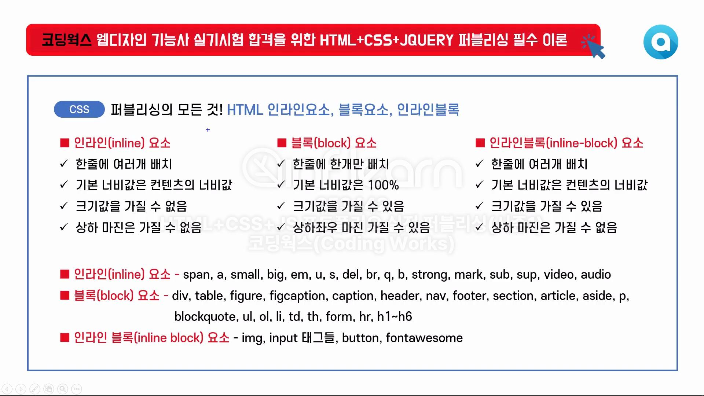
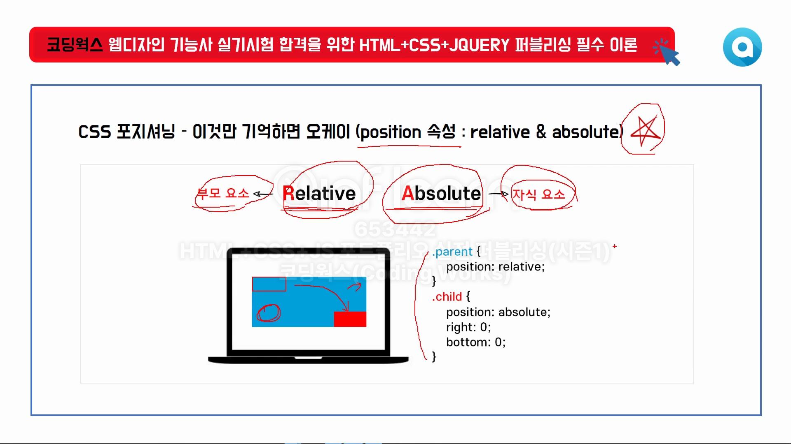

# css 관련 내용 정리

## 1.display

- display 속성중에 inline, block은 암기수준으로 이해하기
- block 이냐 inline 이냐에 따라서 너비 자동세팅, 마진 적용여부 등이 달라짐
- 따라서, 이걸 제대로 이해하지 못하면, 레이아웃 설정하기 쉽지 않음
- 태그 요소들 잘 기억하기
- 그리고 속성으로 block, inline, inline-block을 명시하여 강제하 시킬 수 있고,
- 이런걸 통해서 레이아웃 퍼블리싱 잡는 핵심이 되는 개념
- 인프런 강의 참고
  

### inline

- 가로 배치
- 크기없음(width x) -> 따라서 width 줘봐야 무의미, 크기를 주려면 -> block or inline-block
- 상하마진 속성x -> 크기가 없기 때문, 기본크기만 갖음, css로 설정할 수 없음

### block

- 세로 배치
- 크기 갖음(width 기본 100%)
- 높이, 넓이 설정 (width, height 설정 o)
- 상하좌우 마진 갖음 -> 크기가 있기 때문
- 가운데 정렬 -> margin: auto (block 에만 먹힘)
- 보통 세로배치 하고싶을때
    - 가로 배치로 해야할 경우
    - float, overflow 속성활용 : overflow: hidden, float: left 등, -> 1px도 오차 허용 안됨, box-sizing: border-box; 속성으로 배치
        - float 를 사용할 경우, clear: both 등 다음 속성 영향 받는 경우 해제 필요할 수 있음
    - inline-block 활용: text-align 등 margin : auto 등 다양한 방식으로 레이아웃 설정할 순 있음

```css
/* 1. float , overflow 를 이용한 가로배치 */
section {
    border: 10px solid black;
    width: 400px;
    overflow: hidden;
}

section article {
    width: 100px;
    height: 50px;
    border: 2px solid blue;
    background-color: orange;
    float: left;
    box-sizing: border-box;
}
```

```css
/* 
    2. display: inline-block 를 이용한 가로배치
    - section에 width를 줄경우, 가로 배치 문제 되지 않게 가능하나
    - 마지막 article 넓이가 그만큼 줄어든 현상이 있음 
*/
section {
    border: 5px solid black;
    /*width: 400px;*/
    text-align: center;
    /*overflow: hidden;*/
    /*white-space: nowrap;*/
}

section article {
    width: 100px;
    height: 50px;
    background-color: orange;
    border: 2px solid blue;
    /*display: inline;*/
    display: inline-block;
    box-sizing: border-box;
}
```

### inline-block

- 가로배치 (inline 속성)
- 기본너비는 컨텐츠의 너비값 (inline 속성)
- 크기 갖음 (block 속성)
- width, height 설정 가능 (block 속성)
- 상하마진은 갖을 수 없음 (inline 속성)
- 블록과 인라인 속성을 결합한 형태로 block
  - 가로배치하면서, 크기를 갖어야할 때 활용
  - block -> 가로 배치만 ? inline
  ```css
  section {
      border: 5px solid black;
      /*width: 400px;*/
      text-align: center;
      /*overflow: hidden;*/
      /*white-space: nowrap;*/
  }
  
  section article {
      width: 100px;
      height: 50px;
      background-color: orange;
      border: 2px solid blue;
      display: inline;
      /*box-sizing: border-box;*/
  }
  ```
  
## 2.position

- 부모요소(relative), 자식요소(absolute)
- position 이 있어야 top,left,right,bottom 같은 위치 관련 속성이 의미 있음
- top: 부모 값 -> 벗어남, %로 주면 상대값으로 이동하므로, 부모의 px가 변경되더라도, 자식요소는 변경하지 않아도 됨
  - 따라서, 자식요소는 최대한 %를 활용
- position: absolute 를 주는 순간 무조건 inline-block 로 됨
  - inline -> inline-block
  - block -> inline-block

```css
.parent {
  position: relative;
}

.child {
  position: absolute;
}
```

## 3. 가상클래스
- hover
- transition
- nth-child : 순서 선택, class 없이 선택할때 유용, 태그를 체크 하지 않아서, 유지보수할 때 힘들수 있음
- nth-of-type : 순서선택, 태그 체크
- first-child, last-child

```css
a {
  color: red;
  transition: 1s;
}

a:hover {
  color: black;
}

.box div {
  width: 100px;
  height: 50px;
}

.box div:nth-child(1) {
/*  */
}

.box div:nth-child(2) {
  /*  */
}


```

## 애니메이션
- animation, @keyframes 등 활용하여 움직이는 현상 만들어보기
  - position -> top, left 등 설정한걸 그대로 사용해야함
  - animation-delay : 애니메이션 딜레이 시킨 후 시작
- 다양한 css, 셀렉터 (nth-child, ...), calc 등 활용
